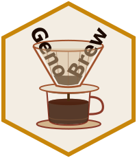

<!-- badges: start -->
[](https://github.com/Breeding-Insight/GenoBrew/actions)

[](https://img.shields.io/badge/development-active-blue.svg)

[](https://app.codecov.io/gh/Breeding-Insight/GenoBrew)

<!-- badges: end -->

# GenoBrew 

**GenoBrew** is a user-friendly R Shiny application for measuring marker
panel efficiency according to dataset, help users optmize markers selection, 
perform basic relationship analysis, and visualization and curation of copy number variation (CNV) profiles. It
includes built-in datasets for *alfalfa* genomic data exploration
and analysis, designed to support breeders and researchers without
requiring command-line expertise.

### Key Features

- **Web-Based Interface:** Run analyses directly in the browser — no
  command-line required.
- **Select Markers module:** Compare marker statistics derived from
  whole-genome sequencing (WGS), GBS, or other sequencing technology with a set marker panel.
- **CNV Profiles module:** Explore interactive visualizations and curation of copy
  number variation profiles across samples. Also visualize relationship statistics for families.
- **Built-in datasets:** Includes the Alfalfa F1 population dataset, ready to load for analysis. This dataset is publicly available and validated using the Alfalfa 3k DArTag marker panel.
- **Upload your own data:** Accepts VCF and CNV files in CSV/TSV/GZ
  formats alongside a custom marker panel CSV.

### Modules

#### Select Markers

Loads a VCF file (or built-in WGS dataset) and a marker panel, then
computes and displays:

- WGS marker count, panel marker count, common markers, and markers
  passing filters
- Interactive marker distribution plot
- Filters: minimum MAF, maximum missing data, depth range, heterozygosity range,
  maximum % CNV ≠ 2
- Genomic relationship plots


#### CNV Profiles

Loads `Qploidy2` output files (or built-in dataset) and visualizes:
See more about `Qplody2` in its [repository](https://github.com/Breeding-Insight/Qploidy2/tree/main).

- Genome-wide CNV profiles for combined samples
- BAF, zscore and CNV calls plots for single sample
- Curation of results by re-running HMM for specific samples with user-defined parameters

### Getting Started

#### Demo

You can explore GenoBrew features accessing its [shinyapps.io version](https://cris-taniguti.shinyapps.io/genobrew/), but the server has limited resources, for larger datasets you will need to install the app in our local computer. 

#### Local Installation

1. **Install R** (≥ 4.1.0) from [CRAN](https://cran.r-project.org/).

2. **Install GenoBrew:**

```r
if (!require("remotes", quietly = TRUE)) install.packages("remotes")
remotes::install_github("Breeding-Insight/GenoBrew", dependencies = TRUE)
```

3. **Launch the app:**

```r
GenoBrew::run_app()
```

4. The GenoBrew interface will open in your default web browser.

#### Tutorial

Access GenoBrew tutorial [here](https://scribehow.com/viewer/GenoBrew_Interactive_Marker_Panel_Evaluation_CNV_Visualization_and_Curation__4uWloBuPT1WlnCvW2UWiTg).

### How to cite

If you use GenoBrew in research or breeding analyses, please cite it as:

Taniguti, C. H.; Chinchilla-Vargas, J.; Casa, Alexandra. 
GenoBrew: A user-friendly Shiny app for evaluating marker panel efficiency and visualizing CNV profiles
RRID: SCR_028314

### Funding

GenoBrew development is supported by
[Breeding Insight](https://www.breedinginsight.org/), a USDA-funded
initiative hosted at the University of Florida – IFAS.

## License

This project is licensed under the Apache-2.0 license. See
[LICENSE](LICENSE) for details.
